<p align="center">
  
</p>

<h1 align="center">BuildLore — Styled Markdown Preview</h1>

<p align="center">
  Preview your markdown with 13 professional templates. One-click template switching, live preview, and HTML export — all inside VS Code.
</p>

---


## Features

- **13 Built-in Templates** — Standard, Manuscript, Briefing, Scholar, Journal, Dispatch, Handbook, Midnight, Blueprint, Canvas, Folio, Protocol, and Ink
- **Live Preview** — See styled output update as you type
- **One-Click Template Switching** — Quickly swap between templates via the command palette or status bar
- **HTML Export** — Export your styled markdown as a standalone HTML file
- **Per-Project Config** — Drop a `.buildlore.json` in your project root to set a default template

## Template Gallery

| | | |
|---|---|---|
| 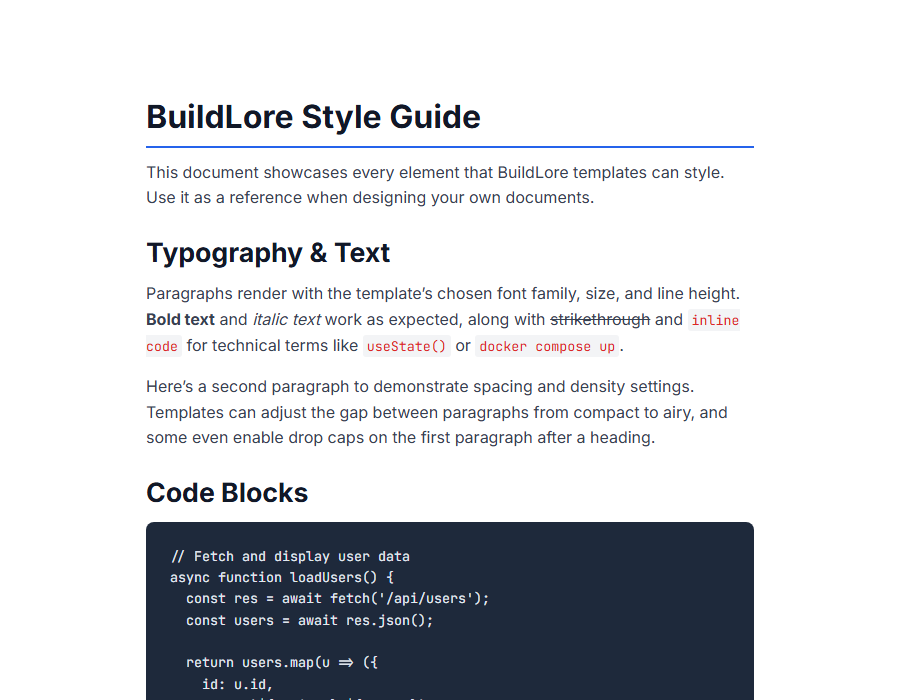 | 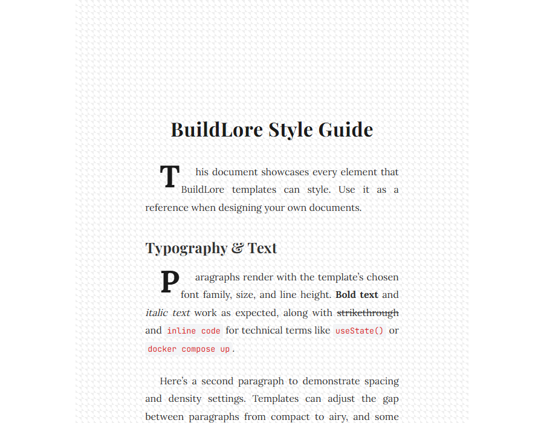 | 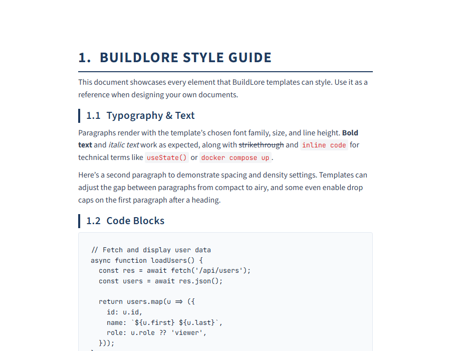 |
| Standard | Manuscript | Briefing |
| 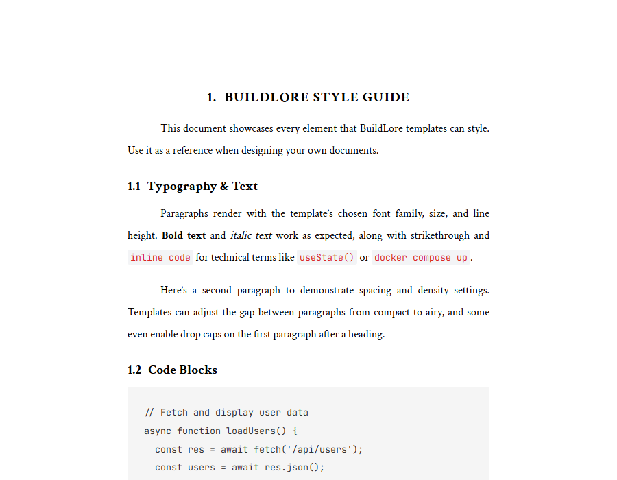 | 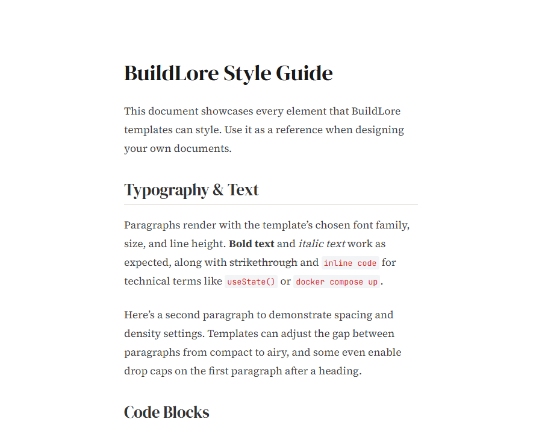 | 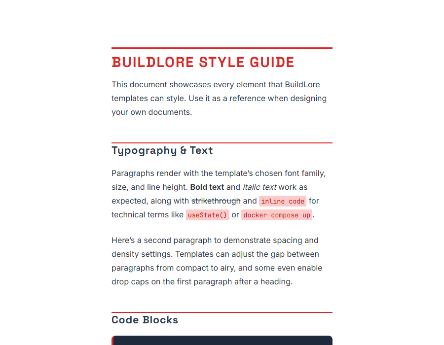 |
| Scholar | Journal | Dispatch |
| 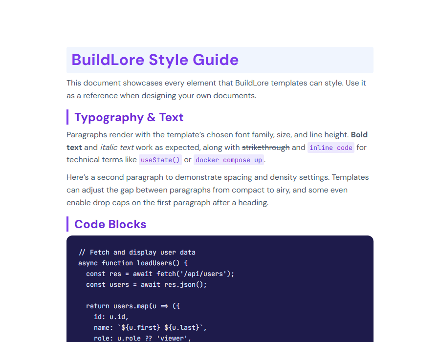 | 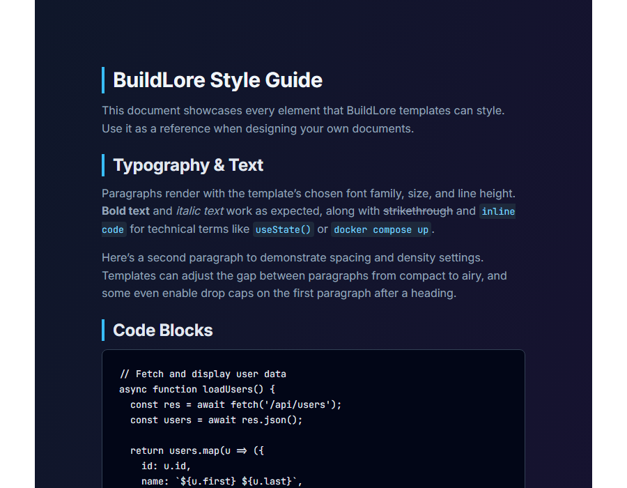 | 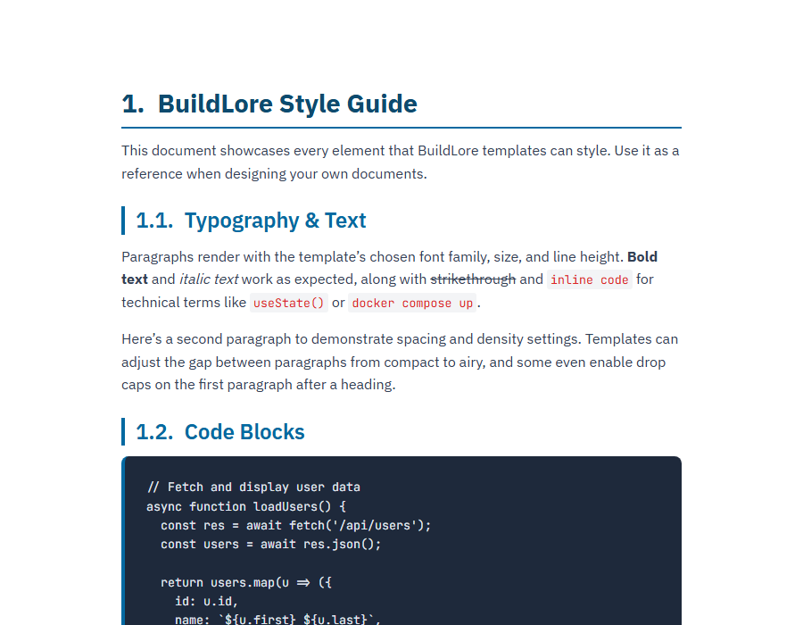 |
| Handbook | Midnight | Blueprint |
| 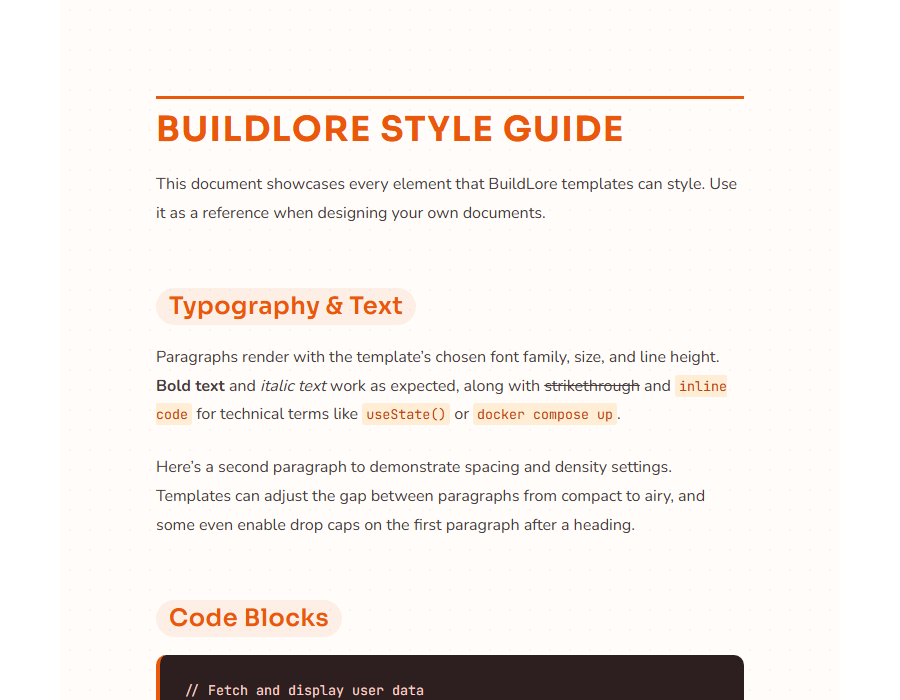 | 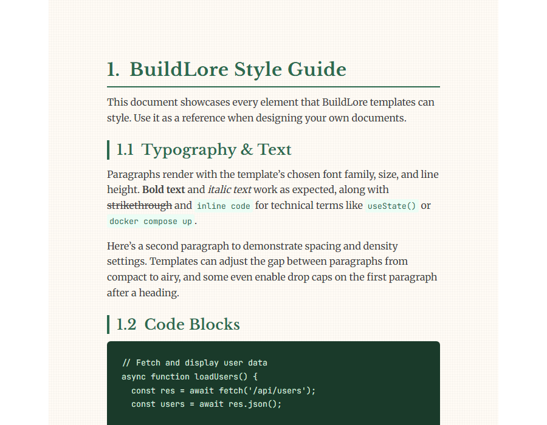 | 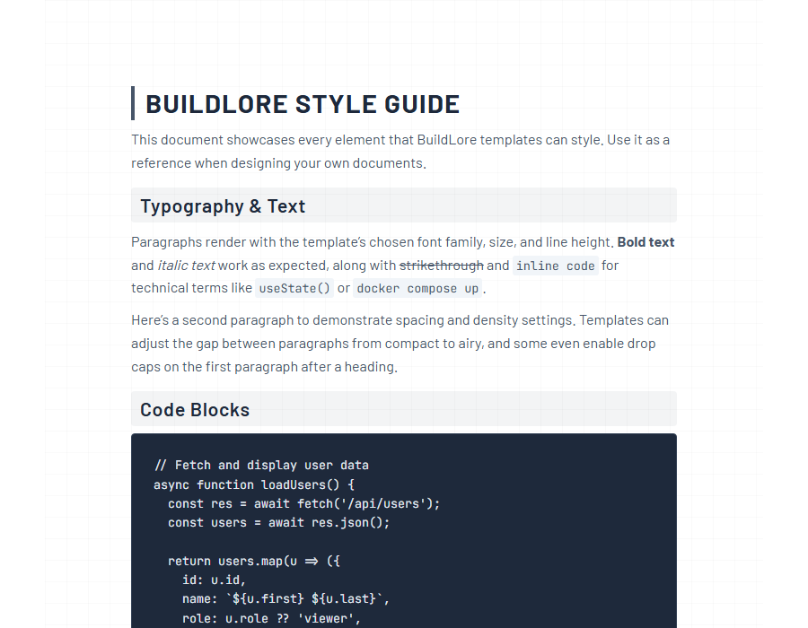 |
| Canvas | Folio | Protocol |
| 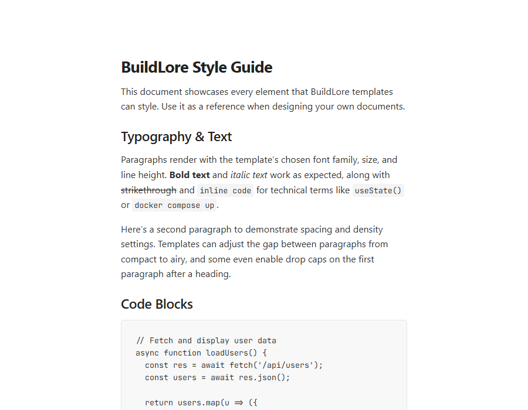 | | |
| Ink | | |

## Usage

1. Open any `.md` file
2. Run **BuildLore: Open Preview to Side** from the command palette (`Ctrl+K B`)
3. Switch templates with **BuildLore: Select Template** or click `BL: [Template]` in the status bar
4. Export with **BuildLore: Export as HTML**

## Commands

| Command | Description |
|---------|-------------|
| `BuildLore: Open Styled Preview` | Open preview in the current editor group |
| `BuildLore: Open Preview to Side` | Open preview in a side panel |
| `BuildLore: Select Template` | Pick from 13 templates |
| `BuildLore: Export as HTML` | Save styled output as an HTML file |

## Project Configuration

Create a `.buildlore.json` in your workspace root:

```json
{
  "template": "Standard"
}
```

## License

MIT
